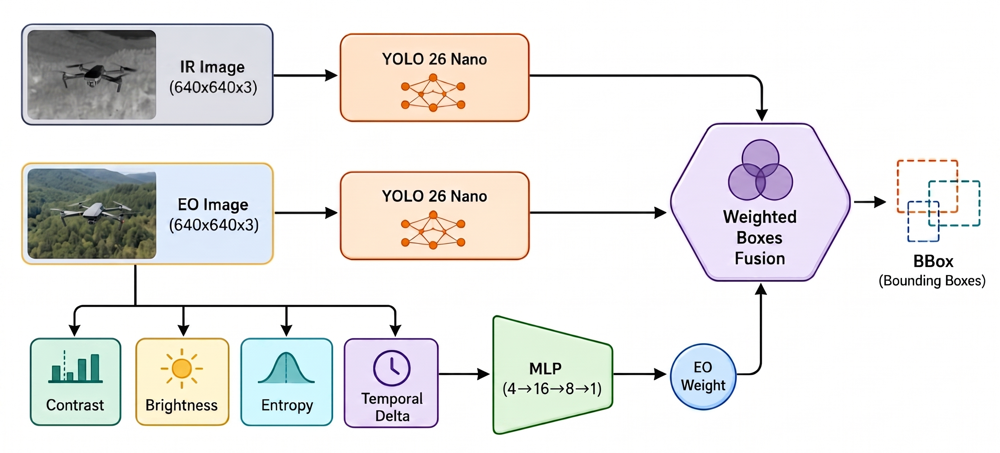

# Drone-Guard-NPU

**DeepX M1 NPU 기반 EO/IR 융합 드론 탐지 시스템**

YOLO26nano 아키텍처를 DeepX M1 NPU에 최적화하여 EO(가시광)/IR(적외선) 이중 영상을 실시간 분석하고, WebSocket을 통해 추론 결과와 원본 이미지를 로컬 서버로 스트리밍합니다.

---

## 목차

1. [시스템 개요](#시스템-개요)
2. [AI 모델 구조](#ai-모델-구조)
3. [서비스 구조](#서비스-구조)
4. [성능 지표](#성능-지표)
5. [프로젝트 구조](#프로젝트-구조)
6. [설치 및 실행](#설치-및-실행)
7. [통신 프로토콜](#통신-프로토콜)
8. [설정 옵션](#설정-옵션)

---

## 시스템 개요

Drone-Guard-NPU는 드론(UAV) 탐지를 목적으로 EO 카메라와 IR 카메라의 영상을 동시에 분석하는 엣지 AI 추론 시스템입니다.

- **추론 하드웨어**: DeepX M1 NPU (`dx_engine.InferenceEngine`)
- **검출 대상**: UAV (무인 항공기)
- **입력**: EO 비디오 + IR 비디오 (각각 640×640 리사이즈)
- **출력**: JPEG 이미지 + 바운딩 박스 JSON → WebSocket 실시간 전송

핵심 성능 최적화:
| 최적화 | 설명 |
|--------|------|
| Frame Prefetcher | `cv2.VideoCapture.read()`를 백그라운드 스레드로 분리, NPU 대기 시간 제거 |
| EO ‖ IR ‖ MLP 병렬 추론 | `ThreadPoolExecutor` 또는 `RunAsync`로 세 모델 동시 실행 |
| 추론 ⇆ 인코딩 ⇆ 송신 분리 | `asyncio.Queue` + 백그라운드 sender로 파이프라인 구성 |
| Lookahead 파이프라이닝 | 최대 N 프레임 선행 제출로 NPU 활용률 극대화 |

---

## AI 모델 구조



### 모델 구성

시스템은 세 개의 DeepX 컴파일 모델(`.dxnn`)로 구성됩니다.

```
weights/dxcom/
├── yolo26n_eo.dxnn   # EO(가시광) 전용 YOLO26nano 검출기
├── yolo26n_ir.dxnn   # IR(적외선) 전용 YOLO26nano 검출기
└── fusion.dxnn       # EO/IR 융합 가중치 결정 MLP
```

#### 1. EO 검출기 (`yolo26n_eo.dxnn`)

- 아키텍처: YOLO26nano
- 입력: `(1, 640, 640, 3)` uint8 BGR
- 출력: `(1, N, 6)` — `[x1, y1, x2, y2, conf, class_id]`
- 가시광 영역 특화 학습

#### 2. IR 검출기 (`yolo26n_ir.dxnn`)

- 아키텍처: YOLO26nano
- 입력: `(1, 640, 640, 3)` uint8 (단채널 그레이스케일 → BGR 변환)
- 출력: EO 검출기와 동일 형식
- 열화상 영역 특화 학습

#### 3. 융합 MLP (`fusion.dxnn`)

- 입력: 4차원 특징 벡터 `[contrast, entropy, brightness, temporal_delta]`
- 출력: EO 신뢰 가중치 `w ∈ [0, 1]` (IR 가중치 = `1 - w`)
- 역할: 조명·환경 조건에 따라 EO/IR 기여도를 동적 결정

**특징 벡터 추출 (`src/core/preprocessing.py`)**

| 특징 | 계산 방법 |
|------|-----------|
| `contrast` | 중앙 70% 크롭 그레이스케일의 표준편차 / 255 |
| `entropy` | 픽셀 히스토그램 기반 정보 엔트로피 (0~1 정규화) |
| `brightness` | 평균 밝기 / 255 |
| `temporal_delta` | 현재 프레임과 직전 EO 프레임의 밝기 차이 |

특징 벡터는 훈련 시 통계(`mean`, `std`)로 z-score 정규화 후 MLP에 입력됩니다.

#### 4. WBF 융합 (`src/core/wbf.py`)

MLP 출력 가중치를 사용하는 greedy Weighted Box Fusion:

1. EO 검출 점수 × `w`, IR 검출 점수 × `(1 - w)`
2. 가중 점수 내림차순 정렬
3. IoU ≥ `iou_thr`인 박스들을 클러스터로 병합
4. 클러스터 내 점수 가중 평균 좌표 → 최종 바운딩 박스

---

## 서비스 구조


### 실행 모드

| 모드 | 설명 | 활성화 조건 |
|------|------|-------------|
| **WebSocket 스트리밍** | DPX1 패킷을 WSS로 실시간 전송 | `--ws_url` 지정 |
| **파일 저장** | 프레임별 JPEG + JSON을 디스크 저장 | `--ws_url` 미지정 (기본) |

### WebSocket 연결 흐름

```
클라이언트                          서버
    │── hello (JSON) ──────────────►│  client_id, auth token, capabilities
    │◄── hello_ack (JSON) ──────────│  session_id 반환
    │                               │
    │── DPX1 packet (binary) ──────►│  JPEG + 검출 결과 반복 전송
    │── DPX1 packet (binary) ──────►│
    │         ...                   │
```

접속 오류 발생 시 지수 백오프(0.2초 → 최대 5초)로 자동 재연결합니다.

---

## 성능 지표

YOLO26nano EO/IR 융합 모델 (UAV 단일 클래스 기준)

| 지표 | 값 |
|------|----|
| **mAP@0.5** | **0.8679** |
| **mAP@0.5:0.95** | **0.5107** |
| **추론 FPS** | **36.90** |
| 입력 해상도 | 640 × 640 |
| 런타임 | DeepX M1 NPU |
| 평가 데이터셋 | [Anti-UAV300](https://github.com/ZhaoJ9014/Anti-UAV) |

---

## 프로젝트 구조

```
Drone-Guard-NPU/
├── project/
│   ├── ai-client.py          # 메인 진입점 — 추론 파이프라인 및 WebSocket 스트리밍
│   ├── .env                  # 환경 변수 (WS_URL, WS_TOKEN 등) [git 제외]
│   └── cert.pem              # WSS 로컬 TLS 인증서 [git 제외]
├── src/
│   └── core/
│       ├── preprocessing.py  # 특징 추출 (contrast, entropy, brightness, temporal_delta)
│       └── wbf.py            # Greedy Weighted Box Fusion
├── data/
│   └── video/
│       ├── visible.mp4       # EO(가시광) 입력 비디오 [git 제외]
│       └── infrared.mp4      # IR(적외선) 입력 비디오 [git 제외]
└── weights/
    └── dxcom/
        ├── yolo26n_eo.dxnn   # EO 검출 모델 (DeepX 컴파일)
        ├── yolo26n_ir.dxnn   # IR 검출 모델 (DeepX 컴파일)
        └── fusion.dxnn       # 융합 가중치 MLP (DeepX 컴파일)
```

### cert.pem — 로컬 WSS 인증서 발급

로컬 서버와 `wss://` 로 통신할 때 자체 서명 인증서가 필요합니다. 아래 명령으로 `project/` 디렉터리 안에 생성하세요.

```bash
openssl req -x509 -newkey rsa:2048 -nodes \
  -keyout project/key.pem \
  -out project/cert.pem \
  -days 365 \
  -subj "/CN=localhost"
```

생성 후 서버 측에 `cert.pem` + `key.pem`을 등록하고, 클라이언트 실행 시 `--cert project/cert.pem` 을 지정합니다.

---

## 설치 및 실행

### 의존성

```bash
pip install opencv-python numpy websockets python-dotenv
# DeepX M1 NPU 드라이버 및 dx_engine SDK 별도 설치 필요
```

### 환경 변수 (`.env`)

```env
WS_URL=wss://your-server/ws
WS_CLIENT_ID=fusion-01
WS_TOKEN=your-secret-token
CERT=/path/to/ca.crt        # 자체 서명 인증서 사용 시
FPS=30                       # 최대 스트리밍 FPS (0 = 무제한)
CLASS_NAMES=UAV
MAX_DETS=10
```

### WebSocket 스트리밍 실행

```bash
python project/ai-client.py \
  --eo_video data/video/visible.mp4 \
  --ir_video data/video/infrared.mp4 \
  --ws_url wss://localhost:8765/ws \
  --fps 30 \
  --loop
```

### 파일 저장 실행 (서버 없이 테스트)

```bash
python project/ai-client.py \
  --eo_video data/video/visible.mp4 \
  --ir_video data/video/infrared.mp4 \
  --output_dir output/demo_video
```

---

## 통신 프로토콜

### DPX1 바이너리 패킷 포맷

```
┌─────────────────────────────────────────────┐
│ Magic (4B)   │ "DPX1"                        │
│ Version (1B) │ 0x01                          │
│ Header Len   │ uint16 big-endian             │
│ Header JSON  │ UTF-8 (Header Len 바이트)     │
│ JPEG 이미지  │ (header.image.size 바이트)    │
└─────────────────────────────────────────────┘
```

### 헤더 JSON 스키마

```json
{
  "type":          "frame",
  "frame_seq":     1234,
  "capture_ns":    1700000000000000000,
  "infer_done_ns": 1700000000027000000,
  "send_ns":       1700000000028000000,
  "fusion_weight": 0.7123,
  "image": {
    "format": "jpeg",
    "w": 640,
    "h": 640,
    "size": 18456
  },
  "detections": [
    {
      "class_id":   0,
      "class_name": "UAV",
      "score":      0.8734,
      "bbox":       [120.5, 80.2, 200.3, 160.7]
    }
  ],
  "model_version": "fusion-npu-1.0"
}
```

---

## 설정 옵션

| 옵션 | 기본값 | 설명 |
|------|--------|------|
| `--eo_video` | `data/video/visible.mp4` | EO 비디오 경로 |
| `--ir_video` | `data/video/infrared.mp4` | IR 비디오 경로 |
| `--eo_model` | `weights/dxcom/yolo26n_eo.dxnn` | EO 모델 경로 |
| `--ir_model` | `weights/dxcom/yolo26n_ir.dxnn` | IR 모델 경로 |
| `--mlp_model` | `weights/dxcom/fusion.dxnn` | 융합 MLP 경로 |
| `--conf` | `0.25` | 검출 신뢰도 임계값 |
| `--iou_thr` | `0.55` | WBF 병합 IoU 임계값 |
| `--fps` | `0` (무제한) | 최대 스트리밍 FPS |
| `--loop` | `false` | 영상 종료 시 반복 재생 |
| `--output_modal` | `eo` | 전송 이미지 선택 (`eo` / `ir`) |
| `--max_dets` | `0` (무제한) | 프레임당 최대 검출 수 |
| `--lookahead` | `1` | 선행 추론 프레임 수 |
| `--prefetch` | `64` | 비디오 프리페치 큐 크기 |
| `--cpu_workers` | `4` | CPU 워커 스레드 수 |
| `--no_parallel` | `false` | EO/IR 병렬 추론 비활성화 (디버그용) |
| `--cert` | - | WSS 자체 서명 인증서 경로 |
